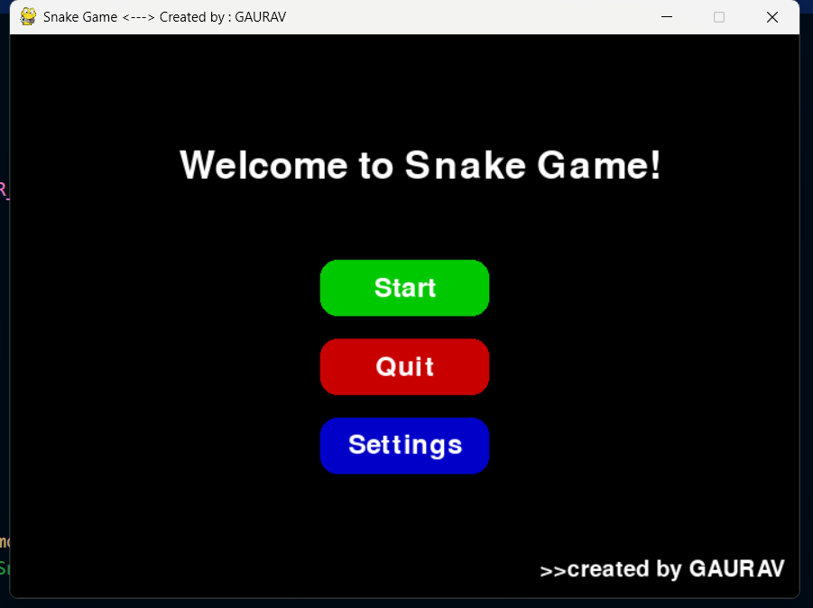
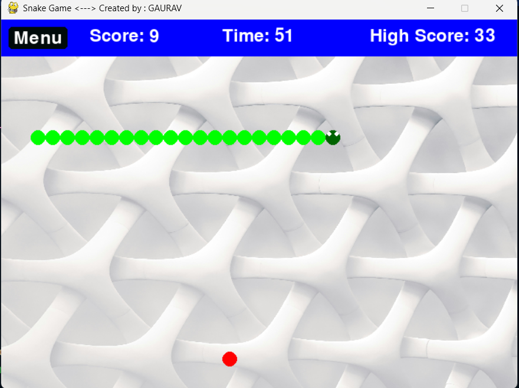
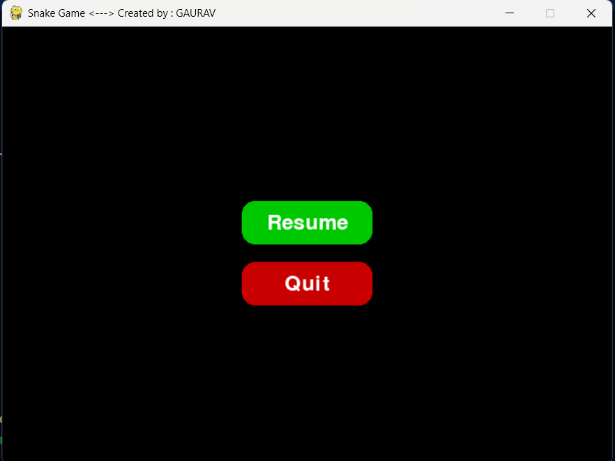
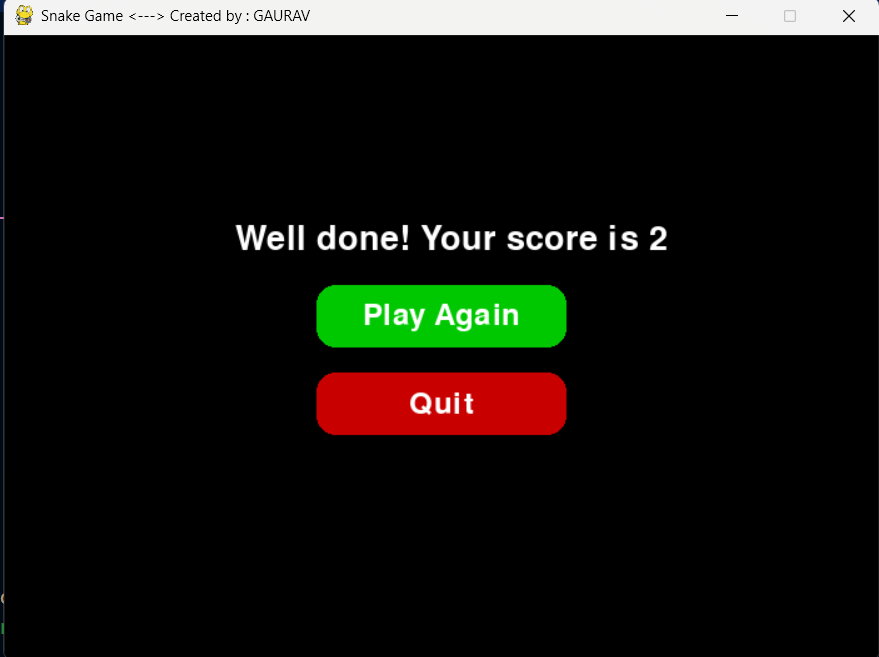
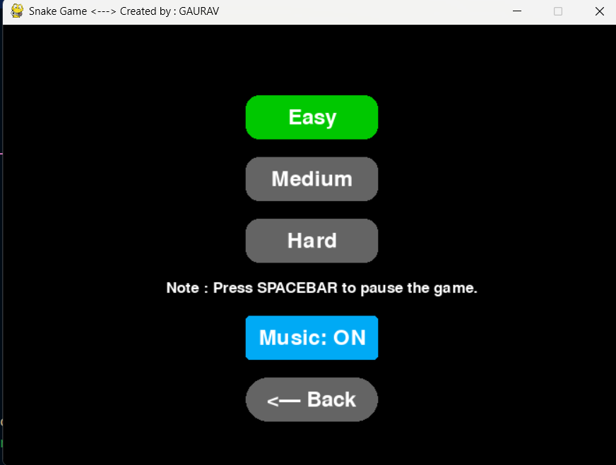

  ◆◆◆◆◆◆◆◆◆◆◆◆◆◆◆◆◆◆◆     ◆◆◆◆◆◆◆◆◆◆◆◆◆◆◆◆
# ◆◆ Snake-Game-using-Python   ◆◆◆  Created by: GAURAV ◆◆
  ◆◆◆◆◆◆◆◆◆◆◆◆◆◆◆◆◆◆◆     ◆◆◆◆◆◆◆◆◆◆◆◆◆◆◆◆
  
This is a fun and interactive Snake Game where you control a snake to eat food and grow longer. Avoid collisions with walls and yourself! 
This repository contains a classic Snake Game implemented in Python using the Pygame library. The game features a snake that grows in length as it eats food, and the player must navigate the snake without colliding with the walls or itself. The game includes a graphical user interface, sound effects, and multiple difficulty levels.

# Table of Contents #
  * Game Overview
  * Code Structure
  * Key Features
  * How to Run
  * Dependencies
  * Future Improvements

## 📂 Project Structure

```
/Login-and-Signup-form-using-HTML-CSS-JS
│
├── main.py               # Main Python file containing both forms
├── high_score.json       # CSS for layout, colors, and responsiveness
├── button_click.wav      # JavaScript for form switching and validation
|__ game_over.wav         # game over sound when snake goes out of boundary
|__ eat_sound.wav         # eating sound when snake eat food
|__ background_image.jpg  # background image file
|__ background_music.mp3  # play music on background
└── README.md           # Project documentation (this file)
```

## Game Overview ##
The Snake Game is a classic arcade game where the player controls a snake that moves around the screen, eating food to grow longer. The game ends if the snake collides with the walls or itself. The goal is to achieve the highest possible score by eating as much food as possible.

## Code Structure ##
The code is organized into several sections, each handling a specific aspect of the game:

# 1. Initialization and Constants
   - The game initializes Pygame and sets up the screen dimensions, colors, and fonts.
   - Constants like WIDTH, HEIGHT, CELL_SIZE, and NAVBAR_HEIGHT define the game's layout.
   - Colors are defined using RGB tuples for easy customization.

# 2. Sound Effects and Background Music
   - The game loads sound effects for eating food, game over, and button clicks.
   - Background music is played in a loop during gameplay.
   - If sound files are missing, the game gracefully handles the absence of audio.

# 3. Difficulty Levels
   - The game offers three difficulty levels: Easy, Medium, and Hard.
   - Each difficulty level corresponds to a different snake speed, controlled by the DIFFICULTY_SPEED dictionary.

# 4. High Score System
   - The game saves and loads the high score using a JSON file (high_score.json).
   - The high score is displayed in the navigation bar during gameplay.

# 5. Button Class
  - A reusable Button class is implemented to create interactive buttons for the start screen, settings, and pause menu.
  - Buttons change color when hovered over and can be clicked to trigger actions.

# 6. Game Variables
   - The snake is represented as a list of tuples, where each tuple represents the coordinates of a segment.
   - The food is randomly placed on the screen, and a timer ensures it respawns if not eaten within a certain time.

# 7. Game Screens
   - Start Screen: Displays the game title, creator name, and buttons to start the game, access settings, or quit.
   - Settings Screen: Allows the player to change the difficulty level and toggle background music.
   - Pause Screen: Pauses the game and provides options to resume or quit.
   - Game Over Screen: Displays the final score and offers options to play again or quit.

# 8. Game Logic
   - The snake's movement is controlled by arrow keys, and its direction is updated based on player input.
   - Collision detection checks if the snake hits the walls or itself.
   - The snake grows in length when it eats food, and the score increases.

# 9. Main Game Loop
   - The main loop handles events (e.g., keyboard input, button clicks), updates the game state, and renders the screen.
   - The game runs at a frame rate determined by the selected difficulty level.

## Key Features ##
- Customizable Difficulty: Players can choose between Easy, Medium, and Hard difficulty levels, each with different snake speeds.
- High Score System: The game saves the highest score achieved by the player.
- Sound Effects: The game includes sound effects for eating food, game over, and button clicks.
- Background Music: Background music plays during gameplay and can be toggled on/off in the settings.
- Responsive UI: Buttons and menus are designed to be intuitive and visually appealing.
- Pause Functionality: Players can pause the game at any time using the spacebar.

# 🎮 Controls
  + Arrow Keys (↑ ↓ ← →) - Move the snake
  + SPACEBAR - Pause/Resume the game
  + Mouse Click - Navigate menus

## Heightlight points ##
✔️ Multiple Difficulty Levels
✔️ Dynamic Score & Timer
✔️ Game Over & Restart
✔️ Settings Menu
✔️ Background Music
✔️ Responsive UI

## How to Run ▶ ##
+ Install Dependencies:
  - Ensure Python 3.x is installed.
  - Install Pygame using pip : pip install pygame
 
---

## 📸 Screenshots

### Starting Interface (option to start game)



### Playground Interfacem (we can pause game by pressing spacebar)



### Resuming Interface (option to resume or quit the game)



### Game Over Interface (option to play again or quit the game)



### Menu or Setting Interface (option to change difficulty mode or music on/off)



---

# Download the Code:
  - Clone this repository or download the main.py file.
  - Ensure these files are in the same folder as the script:
      + eat_sound.wav
      + game_over.wav
      + button_click.wav
      + background_music.mp3
      + background_image.jpg (optional)

# Run the Game:
  - Navigate to the directory containing the game file and run : python main.py

# Play the Game:
  - Use the arrow keys to control the snake.
  - Press the spacebar to pause the game.
  - Access the settings menu to change difficulty or toggle music.

# ▶ Note ◀
   - If sound files are missing, the game will still run (with warnings).
   - The high score is saved in high_score.json.
